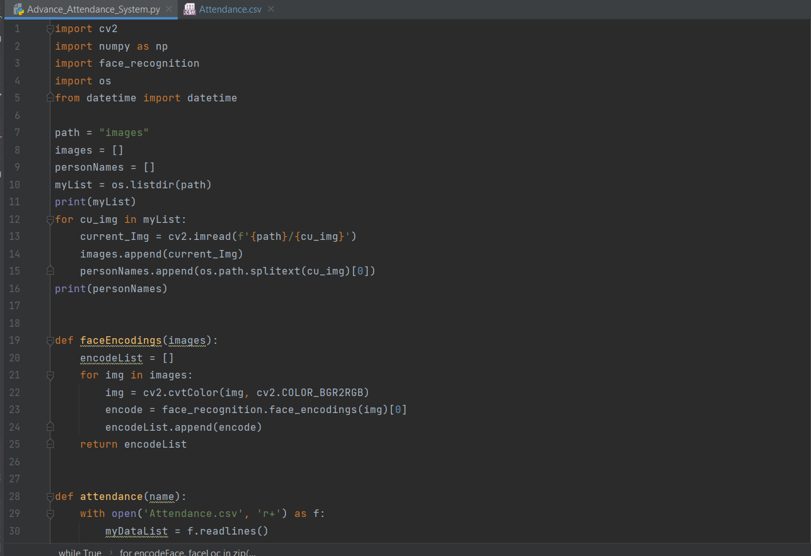
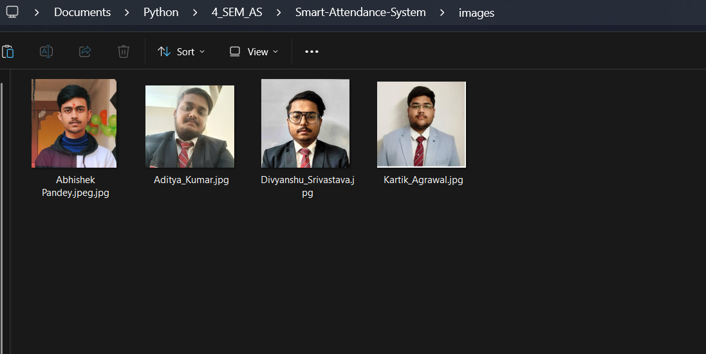
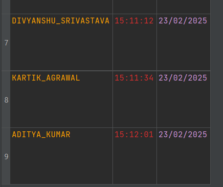

# 📸 Smart Attendance System

This project implements a **Smart Attendance System** using facial recognition technology to automate and streamline attendance recording.

## 📷 Project Demonstration

<p align="center">
  
  
</p>

<p align="center">
  
</p>

## 🚀 Features

✔ **Facial Recognition**: Uses computer vision to identify and verify individuals.  
✔ **Automated Attendance Logging**: Records attendance in real-time, reducing manual effort.  
✔ **User-Friendly Interface**: Simple and intuitive interface for ease of use.  
✔ **Secure Data Storage**: Stores attendance data efficiently in a structured format.

## 🛠️ Installation

1. **Clone the Repository**:
   ```bash
   git clone https://github.com/0Divyanshu0/Smart-Attendance-System.git
   ```

2. **Navigate to the Project Directory**:
   ```bash
   cd Smart-Attendance-System
   ```

3. **Install Dependencies**:
   Ensure Python is installed, then install the required packages using:
   ```bash
   pip install -r requirements.txt
   ```

   *If `requirements.txt` is missing, install OpenCV manually:*  
   ```bash
   pip install opencv-python
   ```

## 📂 Project Structure

```
Smart-Attendance-System/
│── 📁 demo_pics/          # Screenshots and visual representation
│── 📄 Advance_Attendance_System.py   # Main application script
│── 📄 Attendance.csv      # CSV file storing attendance records
│── 📄 README.md           # Project documentation
```

## ▶️ Usage

1. **Run the Application**:
   ```bash
   python Advance_Attendance_System.py
   ```

2. **System Workflow**:
   - The system accesses the camera to detect and recognize faces.
   - Recognized individuals are marked present in `Attendance.csv`.
   - Attendance is automatically logged with timestamps.

## 💡 Future Enhancements

🔹 Improve facial recognition accuracy with deep learning models.  
🔹 Implement a cloud-based attendance system for remote access.  
🔹 Add multi-user role support (admin, teacher, student).  

## 📝 Contributing

Contributions are welcome! Feel free to fork the repository and submit a pull request if you have any suggestions or improvements. 

